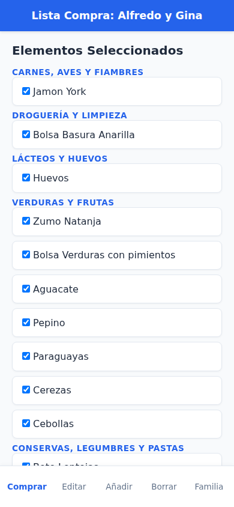
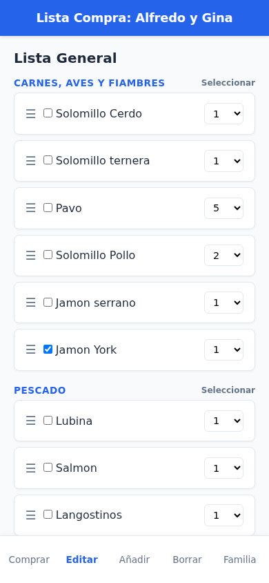
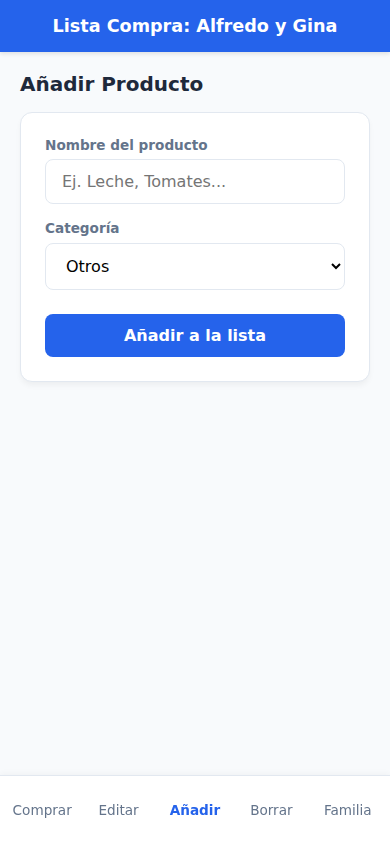
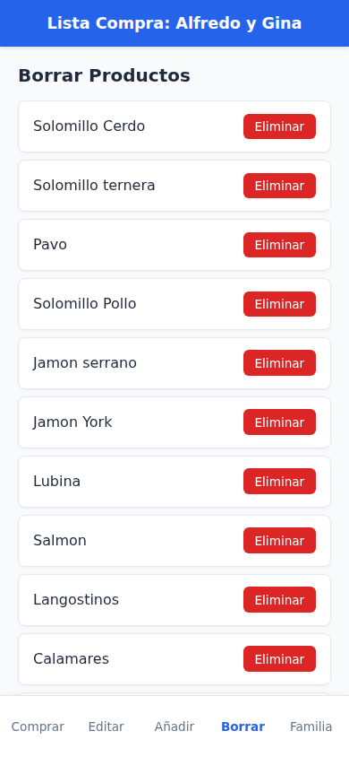

# Lista de la Compra Compartida (lista-compra)

Una aplicación web progresiva (PWA) de **Lista de la Compra Compartida** diseñada para sincronizar en tiempo real los artículos del supermercado que necesitan comprarse. Está optimizada tanto para dispositivos móviles como para navegadores de escritorio.

## Características Principales

La aplicación se estructura en cuatro vistas principales, accesibles mediante la barra de navegación inferior, además de un sistema de gestión multiusuario por familias:

### Concepto de Familia (Listas Independientes)
Para garantizar la independencia y privacidad de las listas, la aplicación utiliza el concepto de **Familia o Agrupación**. Esto permite generar y mantener listas de la compra totalmente independientes para cada hogar o grupo:
- **Asociación inicial**: Al acceder por primera vez, la aplicación solicita al usuario introducir el nombre de su familia o grupo.
- **Sincronización dedicada**: Solo se muestran, modifican o eliminan los productos asociados a dicho identificador familiar.
- **Cambio de Familia**: A través del botón **Familia** en la barra de navegación inferior, se puede consultar el identificador activo y, si se desea, cambiar a otro grupo diferente (lo que restablece la sesión y recarga la interfaz para conectarse a la nueva base de datos familiar).

### Vistas de la Aplicación

1. **Comprar (Lista Compra)**:
   - Muestra los elementos seleccionados para la compra de la familia activa, organizados por su respectiva categoría.
   - Permite marcar/desmarcar los elementos según se van metiendo al carrito de la compra.
   - Muestra las cantidades añadidas de cada producto (por ejemplo, `x2`, `x3`).

   

2. **Editar (Lista General)**:
   - Muestra la lista completa de todos los productos disponibles para la familia, agrupados por categorías.
   - Permite seleccionar o deseleccionar productos individuales y cambiar su cantidad (de 1 a 12 unidades) mediante selectores.
   - Incluye una función para ordenar los elementos dentro de cada categoría mediante arrastrar y soltar (**Drag and Drop** nativo). El orden modificado se guarda de forma persistente en la base de datos.
   - Opción rápida de "Seleccionar todos" / "Deseleccionar todos" por categoría.

   

3. **Añadir**:
   - Formulario sencillo para añadir un nuevo producto indicando su nombre y su categoría/tipología.
   - Las categorías se cargan de forma dinámica. Las categorías disponibles actualmente son:
     - Carnes, aves y fiambres
     - Pescado
     - Droguería y limpieza
     - Lácteos y huevos
     - Verduras y frutas
     - Conservas, legumbres y pastas
     - Panadería y desayuno
     - Otros
     - Carrefour

   

4. **Borrar**:
   - Permite eliminar de manera definitiva cualquier producto de la base de datos de la familia activa en la aplicación.

   

## Tecnologías Utilizadas

- **Frontend**: HTML5, CSS3 (con variables personalizadas, diseño responsive y CSS adaptativo) y JavaScript nativo (ES6+).
- **Base de Datos & Tiempo Real**: **Supabase**, utilizando el cliente JS para la sincronización y persistencia de datos inmediata a través de canales en tiempo real (`supabase_realtime`) filtrados por familia.
- **PWA (Progressive Web App)**: Configurada mediante un archivo `manifest.json` y meta-etiquetas compatibles para permitir su instalación en dispositivos móviles Android e iOS como aplicación nativa.

## Estructura de Archivos

- `index.html`: Contiene toda la estructura visual, estilos CSS responsivos con adaptaciones para zonas seguras de dispositivos móviles (como el indicador de inicio de iOS) y la lógica JS de la interfaz y la integración con Supabase filtrada por la familia actual en `localStorage`.
- `tipos.js`: Módulo que define y exporta las distintas categorías disponibles para clasificar los productos de la compra (`TIPOS_COMPRA`).
- `manifest.json`: Archivo de manifiesto de la aplicación web que define cómo se comporta cuando se instala en el dispositivo móvil del usuario.
- `icono.png`: Icono de la aplicación utilizado para el acceso directo y la pantalla de carga.
- `Creacion tablas.sql`: Sentencias SQL para inicializar la base de datos de Supabase, habilitar el tiempo real y configurar el Row Level Security (RLS). La tabla incluye la columna `familia text null` para filtrar los registros por agrupación familiar.
- `productos_rows.csv`: Archivo de datos iniciales / de muestra con productos habituales ya clasificados por categorías.

## Modelo de Datos (Tabla `productos`)

El esquema de la base de datos en Supabase está definido con los siguientes campos:
* `id` (`bigint`): Identificador único del producto (generado por timestamp).
* `nombre` (`text`): Nombre del artículo.
* `seleccionado` (`boolean`): Estado de selección (si está marcado para comprar o no).
* `tipo` (`character varying(50)`): Categoría del artículo.
* `cantidad` (`integer`): Número de unidades deseadas (por defecto 1).
* `orden` (`integer`): Orden del elemento dentro de su respectiva categoría.
* `familia` (`text`): Identificador del grupo/familia para aislar los datos.

## Próximas Tareas / Road Map

1. **Externalización de categorías**: Migrar los tipos y categorías de productos a una base de datos diferente, permitiendo que cada familia tenga su propio conjunto personalizado de categorías.
2. **Mantenimiento de categorías**: Implementar una interfaz de administración en la aplicación para crear, editar y borrar las categorías de compra de cada familia.
